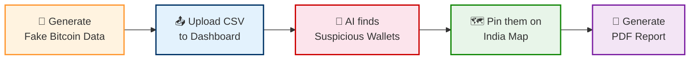
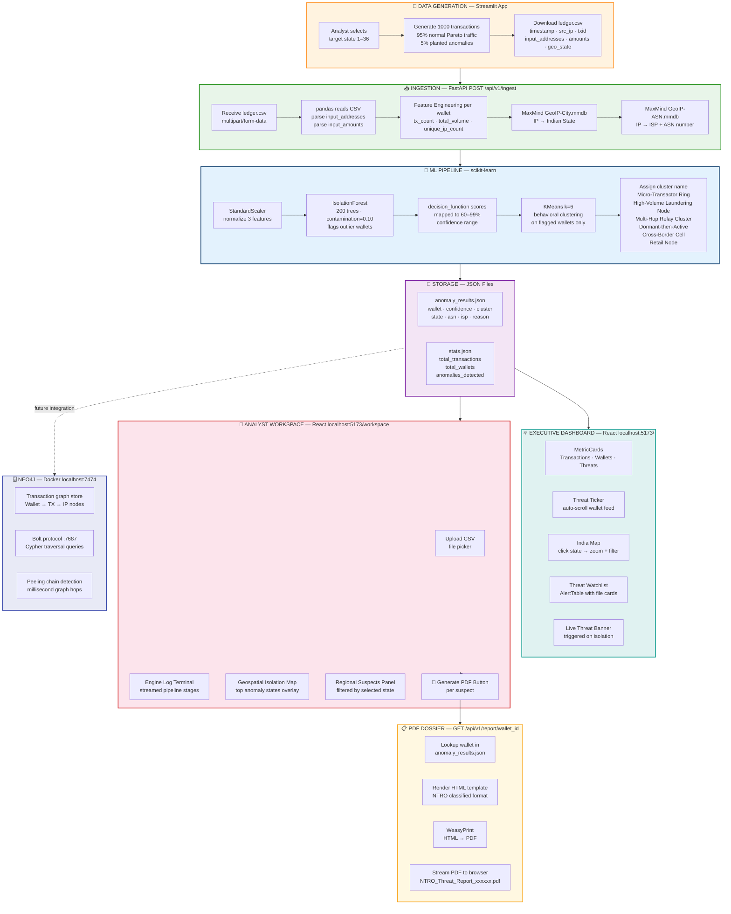

# ChainWatch — Diagrams & Pitch

---

## Marketing Copy

**One-liner**
> Illicit Bitcoin doesn't disappear. ChainWatch finds it.

---

**3-liner**
> Billions move through Bitcoin every day. A fraction of it is criminal. Finding that fraction manually is impossible at scale.
> ChainWatch ingests raw transaction data, applies AI to surface the anomalies, and hands investigators a ranked, explainable list of suspects — in seconds.
> Offline. Domestic. Built for the agencies that can't afford to wait on foreign software.

---

**Paragraph**
> Financial crime on the blockchain is not invisible — it just moves faster than manual investigation can. ChainWatch is an offline intelligence tool that closes that gap. Feed it a transaction file. It correlates network-layer data with on-chain activity, runs anomaly detection across every wallet, clusters suspicious behavior into named patterns, and presents ranked leads with confidence scores — each one explained in plain language. There is no cloud dependency, no foreign API, no data leaving the machine. Investigators get a clean dashboard, an interactive network graph, a geographic threat map, and a one-click PDF report. The tool does not make final determinations — it removes the noise so the analyst can focus on the signal.

---

## One-Liner (Demo-Focused)
> ChainWatch turns thousands of Bitcoin transactions into a visual crime map — click a wallet, see its network, get the PDF report.

---

## 3-Liner (Demo-Focused)
> Bitcoin criminals hide by scattering money across hundreds of wallets and IPs — investigators are drowning in spreadsheets.
> ChainWatch uses AI to auto-flag suspicious wallets, shows you *why* each one was flagged, and plots every connection on an interactive graph and India map.
> Upload a CSV, get ranked alerts with confidence scores — fully offline, zero setup, ready to demo.

---

## Paragraph (Demo-Focused)
> NTRO's problem: investigators have raw Bitcoin transaction data with thousands of wallet addresses, IP addresses, and transaction IDs — but no way to quickly spot the criminals or understand their networks. ChainWatch solves this with a three-layer system. First, an AI engine scans every wallet using Isolation Forest to flag the statistical outliers — wallets moving unusual volumes, hitting too many IPs, or behaving like known laundering patterns. Second, a force-directed graph visualization shows the actual network: click a flagged wallet and watch its connections light up — which IPs it used, which transactions it touched, how money flowed. Third, an interactive India map plots every threat by state with live filtering — click Maharashtra, see only Maharashtra threats. Every alert comes with a confidence score and a plain-language explanation. The entire system runs offline on a local server, ingests standard CSV files, and generates formatted PDF reports with one click. This is built for analysts who need answers in seconds, not hours — where the criminal network is, how it behaves, and why the AI flagged it. The workflow is: upload → auto-analyze → visualize → export. No backend knowledge needed. Just the dashboard.

---

## Technical Version (For PS Submission / Technical Judges)

**One-Liner**
> ChainWatch is an offline AI system that correlates Bitcoin's network-layer (IP/port) and blockchain-layer (wallet/TXID) data to surface explainable, confidence-scored leads — visualized as an interactive graph and map.

**3-Liner**
> NTRO's challenge: correlate raw network metadata (IP, port, timing) with blockchain data (wallets, TXIDs, amounts) to flag Bitcoin-based crime — fully offline, no foreign SaaS.
> ChainWatch ingests CSV transaction-network data, builds a unified entity graph linking IPs, wallets, and TXIDs, and applies Isolation Forest (anomaly detection) and K-Means (behavioral clustering) to flag and group suspicious wallets.
> Every flag ships with a confidence score and a plain-language explanation, shown on an interactive dashboard combining link-analysis graph view and geographic country/ASN mapping via offline GeoIP — running fully on Linux.

**Paragraph**
> NTRO's problem statement calls for a system that correlates Bitcoin's network-layer metadata (IP, port, timing) with its blockchain-layer data (wallet addresses, TXIDs, amounts) to detect illicit activity — entirely offline, using a synthetic dataset modelled on real P2P/transaction fields. ChainWatch does exactly this. It ingests bulk transaction-network data, builds a unified entity graph linking source/destination IPs, wallet addresses, and TXIDs, and resolves IPs to country/ASN using an offline MaxMind GeoIP database. On top of this graph, we engineer behavioral features per wallet — transaction frequency, total volume, unique counterpart IPs, ASN diversity — normalize them with StandardScaler, and run Isolation Forest (200 estimators, contamination=0.10) to flag statistical outliers. The confidence score is derived directly from the Isolation Forest anomaly score, normalized to a 60–99% human-readable range. K-Means (k=6) then clusters flagged wallets into named behavioral patterns. Each alert carries a feature-level explanation — analysts see which features drove the flag (e.g. "primary driver: unique_ip_count at 4.2σ above mean"), not just that a wallet was flagged. Findings are presented on an interactive dashboard with both a link-analysis graph view and a geographic map, exportable as a formatted agency report. The entire pipeline runs on a local Linux server with zero internet dependency. This is a prototype built on synthetic data per the PS's own dataset scope — it prioritizes leads for analyst review, it does not make final determinations.

---

> 📌 **PS Alignment Note**
> The `src_ip`, `dst_ip`, port, and `geo_country/ASN` fields are part of the PS-provided synthetic dataset spec.
> Geographic and ISP attribution in ChainWatch is correlation of that **given network metadata** via offline GeoIP — not derivation from the blockchain itself.
> This is exactly what PS-26146 asks for under *"correlates network-layer with blockchain-layer data."*

---

## Simple Flow (How it works)



---

## Implementation Steps & Detailed Process Flow

---

## Implementation Steps

```mermaid
flowchart TD
    A([🚀 START]) --> B[Step 1: Setup Python Backend\nvenv + install FastAPI, pandas,\nnumpy, scikit-learn, maxminddb,\nweasyprint, uvicorn]
    B --> C[Step 2: Place MaxMind Databases\nGeoIP-City.mmdb + GeoIP-ASN.mmdb\ninto chainwatch_backend/database/]
    C --> D[Step 3: Start FastAPI Server\nuvicorn main:app --port 8000 --reload]
    D --> E[Step 4: Setup Frontend\ncd chainwatch_frontend\nnpm install]
    E --> F[Step 5: Start React Dev Server\nnpm run dev → localhost:5173]
    F --> G[Step 6: Setup Neo4j via Docker\ndocker-compose up -d\nNeo4j Browser → localhost:7474]
    G --> H[Step 7: Start Streamlit Generator\npip install streamlit faker\nstreamlit run generator_app.py\n→ localhost:8501]
    H --> I[Step 8: Generate Synthetic Ledger\nPick target state index 1-36\nClick Generate 1000 Transactions\nDownload ledger.csv]
    I --> J[Step 9: Ingest Ledger\nOpen localhost:5173/workspace\nUpload ledger.csv\nClick RUN AI PIPELINE]
    J --> K[Step 10: Review Results\nWatch engine logs stream\nCheck Regional Suspects panel\nClick Generate PDF for dossier]
    K --> L[Step 11: Executive Dashboard\nNavigate to localhost:5173\nReview Metric Cards + Threat Map\nClick states to filter alerts]
    L --> M([✅ DONE])

    style A fill:#003366,color:#fff
    style M fill:#138808,color:#fff
    style D fill:#009688,color:#fff
    style F fill:#61DAFB,color:#000
    style G fill:#008CC1,color:#fff
    style H fill:#FF4B4B,color:#fff
```



---

## Process Flow Diagram



---

## PS-26146 Coverage Checklist

```mermaid
flowchart TD
    PS[PS-26146\nNTRO — AI-Powered Bitcoin\nTransaction Monitoring]

    PS --> R1["✅ Ingest bulk CSV with\ntimestamp · src_ip · dst_ip · port\ntxid · wallet addresses · amounts"]
    PS --> R2["✅ Correlate network-layer\nIP/port/timing with blockchain-layer\nwallet/TXID/amount"]
    PS --> R3["✅ GeoIP integration\nMaxMind GeoIP-City.mmdb offline\nIP → Indian State + ASN"]
    PS --> R4["✅ AI/ML model — not just rules\nIsolation Forest anomaly detection\nK-Means behavioral clustering"]
    PS --> R5["✅ Ranked explainable alert list\nConfidence score 60–99%\nFeature-level reason per wallet"]
    PS --> R6["✅ Dashboard + visualization\nReact dashboard · India map\nLink-analysis GraphView"]
    PS --> R7["✅ Offline Linux platform\nFastAPI + React\nZero external API calls"]
    PS --> R8["⚠️ Entity/transaction graph\nNeo4j provisioned + GraphView built\nNot yet wired — top priority fix"]
    PS --> R9["⚠️ XML/JSON ingest\nCSV done\nXML/JSON parsers not yet added"]

    style PS fill:#003366,color:#fff,stroke-width:3px
    style R1 fill:#e8f5e9,stroke:#138808
    style R2 fill:#e8f5e9,stroke:#138808
    style R3 fill:#e8f5e9,stroke:#138808
    style R4 fill:#e8f5e9,stroke:#138808
    style R5 fill:#e8f5e9,stroke:#138808
    style R6 fill:#e8f5e9,stroke:#138808
    style R7 fill:#e8f5e9,stroke:#138808
    style R8 fill:#fff3e0,stroke:#FF9933
    style R9 fill:#fff3e0,stroke:#FF9933
```



---

## Explainability Design (How each alert explains itself)

This is what the judge will ask: *"What makes it explainable?"*

```mermaid
flowchart LR
    subgraph FEAT["Feature Engineering per Wallet"]
        F1[tx_count\nhow many transactions] 
        F2[total_volume_btc\nhow much BTC moved]
        F3[unique_ip_count\nhow many distinct IPs used]
    end

    subgraph NORM["StandardScaler"]
        N1[Compute mean + std\nfor each feature\nacross all wallets]
        N2[Normalize each wallet\nto z-score\nvalue - mean / std]
    end

    subgraph ISO["Isolation Forest"]
        I1[200 random decision trees\nShort path = anomaly\nLong path = normal]
        I2[decision_function score\nnormalized to 60–99%\nconfidence]
    end

    subgraph EXPLAIN["Explainability Output per Alert"]
        E1["Which feature is\nfurthest from mean?\ntx_count z=1.2\nvolume z=0.8\nunique_ip z=4.2 ← PRIMARY"]
        E2["Plain language reason:\nAI detected 62 rapid TXNs\nmasking 1408 BTC across\n37 distinct IPs\nPrimary driver: unique_ip_count\n4.2σ above mean"]
    end

    FEAT --> NORM --> ISO --> EXPLAIN

    style FEAT fill:#e3f2fd,stroke:#003366,stroke-width:2px
    style NORM fill:#f3e5f5,stroke:#7b1fa2,stroke-width:2px
    style ISO fill:#fce4ec,stroke:#cc0000,stroke-width:2px
    style EXPLAIN fill:#e8f5e9,stroke:#138808,stroke-width:2px
```



**What to add in `main.py` — one extra block per flagged wallet:**

```python
# After computing X_scaled, store feature z-scores per wallet
feature_names = ["tx_count", "total_volume_btc", "unique_ip_count"]
means = X_scaled.mean(axis=0)   # already 0 after StandardScaler
stds  = X_scaled.std(axis=0)    # already 1 after StandardScaler

# Per flagged wallet — find primary driver
z_scores = X_scaled[i]          # [z_tx, z_vol, z_ip]
primary_idx = np.argmax(np.abs(z_scores))
primary_driver = f"Primary driver: {feature_names[primary_idx]} " \
                 f"({z_scores[primary_idx]:.1f}σ above mean)"

# Append to reason string
reason = f"AI detected {s['tx_count']} rapid TXNs masking " \
         f"{s['volume']:.2f} BTC across {len(s['ips'])} distinct IPs. " \
         + primary_driver
```

---

## Two Remaining Gaps — Fix Plan

| Gap | What PS says | Quickest fix |
|---|---|---|
| **Entity graph not wired** | *"Build an entity/transaction graph linking IPs, wallets, and transactions"* — named deliverable | During `/ingest`, build nodes/links in-memory from the CSV. Add `GET /api/v1/graph` that returns `{nodes, links}`. Wire to existing `GraphView` component. Neo4j optional for demo. |
| **XML/JSON ingest** | *"Ingest bulk metadata dataset in CSV/JSON/XML"* | Add `pandas.read_json()` and `xmltodict` parsing branch in `/ingest` based on file extension. 10 lines of code. |
